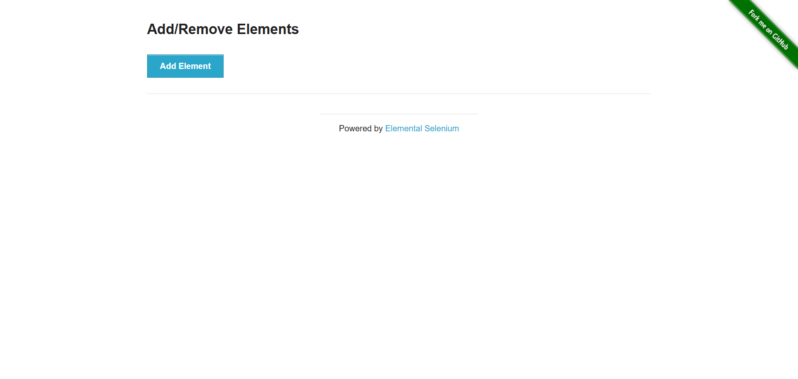

# JIRA-004: UI Lingo - Outdated Terms Still Present

**Summary:**
References to 'ML' and other non-technical terms are still present in the UI after requested changes.

**Steps to Reproduce:**
1. Open the Streamlit UI.
2. Observe dashboard and test execution section headers and labels.

**Expected Result:**
All terminology should use technical/QA/ML language.

**Actual Result:**
Some old lingo remains (see attached screenshot).

**Evidence:**
- Screenshot: 

**Traceability:**
- This markdown file is stored in the bug's subfolder with evidence.

---

*Attach additional evidence as needed.*
